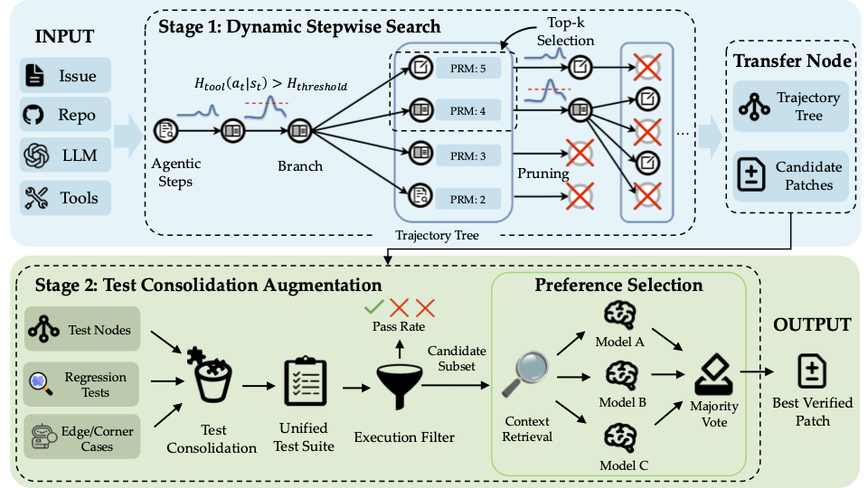

# Entropy-Guided Stepwise Scaling (EGSS)


[](../LICENSE)
[](https://www.python.org/downloads/)

## 🚀 Quick Start

### Run Dynamic Stepwise Search
#### 1. Install Package
Refer to [this](../README.md)

#### 2. Run Example
```bash
cd ./shell_cmd
# Fill all required blank in run_egss_task.sh
sh run_egss_task.sh
```

### Run Test Consolidation Augmentation

Test Consolidation Augmentation is a multi-stage process that includes test case extraction and application, followed by enhancement processing. We provide two main execution scripts to automate this process.

#### 1. Basic Configuration

Before starting, configure the following environment variables and paths:

Make Sure your Input project path looks like

```
/your
└── project
    └── root
        ├── traj/                    # Trajectory files
        │   ├── file_index1
        │   │   ├── astropy__astropy-12907
        │   │   │  └── llm_messages.json
        │   │   └── astropy__astropy-13033
        │   ├── file_index2
        │   ├── file_index3
        │   └── file_index4
        ├── patches/                 # Patch files
        │   ├── file_index1.json
        │   ├── file_index2.json
        │   ├── file_index3.json
        │   └── file_index4.json
        └── scores.json             # Scoring results (not mandatory)

```
Ensure that the names of the individual trajectory directories under the 'traj' directory correspond one-to-one with the names of the corresponding patches under the 'patches' directory.

A Valid llm_messages.json should look like this:
```json
{
  "timestamp": "2025-12-11T14:21:30.759243+00:00",
  "messages": [
    {
      "role": "system",
      "content": "You are an AI coding assistant designed to help developers with their coding tasks. You have access to tools that allow you to read and write files in the workspace.\n\nYour approach:\n1. Carefully analyze the user's request\n2. Use available tools to gather necessary information\n3. Propose clear, well-thought-out solutions\n4. Execute changes carefully and verify results\n\nWhen modifying files:\n- Always read files before modifying them\n- Make precise, targeted changes\n- Explain what you're doing and why\n\nBe concise, accurate, and helpful.\n\n# Environment Information\n- OS: linux 6.8.0-88-generic\n- Python: 3.10.12\n- Working Directory: /testbed\n- Git Branch: main\n- Git Status:\nClean (no changes)"
    },
    {
      "role": "user",
      "content": "xxx"
    },
    {
      "role": "assistant",
      "content": "Perfect! I found the bug.",
      "tool_calls": [
        {
          "id": "",
          "type": "function",
          "function": {
            "name": "read_file",
            "arguments": "{\"path\": \"..\", \"start_line\": 219, \"end_line\": 248}"
          }
        }
      ]
    }
  ]
}
```

A Valid patch file (`/your/project/root/patches/file_index1.json`) should look like this
```json
{
  "astropy__astropy-12907": {
    "model_patch": "diff ..."
  },
  "astropy__astropy-13033": {
    "model_patch": "diff ..."
  }
}
```

A Valid score file (`/your/project/root/score.json`) (btw, the score.json is not mandatory)
```json
{
  "astropy__astropy-12907": {
    "file_index1": 0.2,
    "file_index2": 0.3,
    "file_index3": 0.4,
    "file_index4": 0.1
  }
}
```

Now prepare your important path
```bash
# Input Path
root="/your/project/root"
traj_root="$root/traj"
patch_root="$root/patches"
score_path="$root/scores.json" # Optional

# data_path
data_path="path/to/swe-bench/test-00000-of-00001.parquet"
docker_config_path="path/to/docker_config_swebench_verified.json" # check configs/docker_config_swebench_verified.json for example
voting_model_config="path/to/moe_augment_model_config.json" # check configs/moe_augment_model_config.json for example


# Output Path
deibase_root="path/to/test_consolidate_root" # put logs, execution detail
test_consolidate_root="path/to/test_consolidate_root" # put logs, execution detail
augment_root="path/to/augment_root" # put logs, execution detail

# API setting
api_key="your_api_key_here"
base_url="your_base_url_here" 
model="Kimi-K2-Instruct"

```

#### 2. Execution Scripts

##### Option 1: Deibase Augmentation Scheme (`run_deibase_augment.sh`)

Suitable for scenarios requiring Deibase processing and augmentation:
```bash
cd /path/to/egss
# Fill all required blank in run_deibase_augment.sh
bash shell_cmd/run_deibase_augment.sh
```

**Core Parameter Description:**
- **Deibase Stage** (`run_deibase.py`):
  - `--api-key`: API key (required)
  - `--base-url`: API base URL (required) 
  - `--model`: Model to use, default `Kimi-K2-Instruct`
  - `--docker-name`: Docker container name, default `glm_deibase_tts_8`
  - `--temperature`: Temperature parameter, default `0`
  - `--data-path`: Input data path (required)
  - `--docker-config-path`: docker config path (required)
  - `--root`: Output root directory (required),
  - `--patch-root`: Patch files root directory (required)
  - `--num-processes`: Number of processes, default CPU cores
  - `--save-interval`: Save interval, default `2`

- **Augmentation Stage** (`run_augment_async.py`):
  - `--docker-name`: Docker container name, default `glm_tts_8_moe_augment_runner`
  - `--data-path`: Input data path, typically Deibase output
  - `--docker-config-path`: docker config path (required)
  - `--root`: Augmentation output root directory (required)
  - `--patch-root`: Patch files root directory (required)
  - `--model-config`: Model configuration file path (required)
  - `--num-processes`: Number of processes, default CPU cores

##### Option 2: Test Consolidation Augmentation Scheme (`run_test_consolidate.sh`)

Suitable for complete test case extraction, application, and augmentation workflow:

```bash
cd /path/to/egss
# Fill all required blank in run_test_consolidate.sh
bash shell_cmd/run_test_consolidate.sh
```

**Three-Stage Process Description:**

1. **Test Case Extraction Stage** (`run_extract_test_case.py`):
   - `--api-key`, `--base-url`, `--model`: API configuration (required)
   - `--docker_name`: Docker container name, default `k2_tts_8_test_case_generator`
   - `--data-path`: Input data path
   - `--docker-config-path`: docker config path (required)
   - `--traj-root`: Trajectory files root directory (required)
   - `--root`: Test cases output root directory (required)
   - `--window-size`: Window size, default `2`
   - `--use-existing-data`: Use existing data flag
   - `--num-processes`: Number of processes, default CPU cores

2. **Test Case Application Stage** (`run_apply_test_case.py`):
   - `--api-key`, `--base-url`, `--model`: API configuration (required)
   - `--docker_name`: Docker container name, default `k2_tts_8_test_case_generator`
   - `--docker-config-path`: docker config path (required)
   - `--root`: Test case application output root directory (required)
   - `--patch-root`: Patch files root directory (required)
   - `--num-processes`: Number of processes, default CPU cores

3. **Augmentation Stage** (`run_augment_async.py`):
   - Same as Option 1's augmentation stage, but input data comes from test case application results
   - `--score-path`: Score file path for result evaluation

#### 3. Model Configuration File

The augmentation stage requires model combination configuration. Example configuration file `configs/moe_augment_model_config.json`:

```json
[
    {
        "model": "Kimi-K2-Instruct",
        "prompt": "judge_trae_selector_prompt", 
        "temperature": 0.0,
        "api_key": "",
        "base_url": ""
    },
    {
        "model": "Kimi-K2-Instruct",
        "prompt": "judge_preference_prompt",
        "temperature": 0.0,
        "api_key": "",
        "base_url": ""
    },
    {
        "model": "GLM-4.6",
        "prompt": "judge_trae_selector_prompt",
        "temperature": 1.0,
        "api_key": "",
        "base_url": ""
    }
]
```

**Configuration Description:**
- `model`: Specific model name to use
- `prompt`: Prompt template, optional values include `judge_trae_selector_prompt`, `judge_preference_prompt`
- `temperature`: Model temperature parameter, controls generation randomness

#### 4. Execution Monitoring

Recommended to use `nohup` for background execution and save logs:

```bash
# Deibase augmentation scheme
nohup bash shell_cmd/run_deibase_augment.sh > ./deibase_augment.log 2>&1 &

# Test consolidation augmentation scheme  
nohup bash shell_cmd/run_test_consolidate.sh > ./test_consolidate.log 2>&1 &
```

#### 5. Output Structure

After execution completes, the following structure will be generated in the configured root directory:

```
project_root/
├── deibase_output/          # Deibase processing results
├── augment_output/          # Augmentation processing results
├── test_consolidate_output/ # Test consolidation results
├── traj/                    # Trajectory files
├── patches/                 # Patch files
└── scores.json             # Scoring results
```

